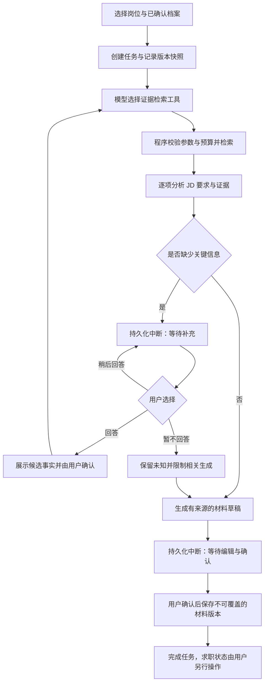

# 架构草案：从证据到可恢复任务

日期：2026-09-13。**本文件描述首版目标架构；目前已有阶段一基础骨架及阶段二资料/岗位管理，正式 Agent 分析与草稿闭环仍待实现。** 文件名和表名用于解释计划，实施时可以精简；不能据此宣称功能完成。已实现代码的串联见[阶段一讲解](stage-one-walkthrough.md)与[阶段二讲解](stage-two-walkthrough.md)。

## 1. 为什么这样分工

普通程序适合精确、可重复的操作，例如保存岗位、校验参数、记录状态。模型适合理解 JD、挑选相关证据和调整表达。LangGraph 连接这些步骤，并在需要用户补充或确认时暂停。

DeepSeek 的工具调用由模型返回工具名称与参数，实际函数仍由应用执行。因此应用可以在执行前拒绝非法名称、参数和访问范围。[DeepSeek 工具调用说明](https://api-docs.deepseek.com/guides/tool_calls/)

首版只有一个主 Agent，提供受限的只读检索工具。保存正式事实、保存材料版本、改变求职状态由明确的业务处理函数执行，不作为模型可自由调用的工具。

## 2. 一次任务的计划流程



模型返回非法结构、找不到合法证据或预算不足时，进入可理解的错误/暂停结果，保留已完成部分。不能为了让流程看起来完成而补造事实。若跳过的信息使某段材料无法可靠生成，明确列出缺口并省略该段；不能将局部完成冒充完整草稿。

用户的补充回答先成为待确认信息；“暂不回答”也要保存，避免恢复时无限重复同一问题。确认新事实后显式更新任务采用的档案版本并重新检查受影响结论，不能悄悄改变历史报告依据。

## 3. 数据与来源

| 概念 | 保存内容 | 关键约束 |
| --- | --- | --- |
| 原始资料与片段 | 本地文件 ID、原名、哈希、类别、页码或行号、文本片段 | 原文不变；学习资料不当个人经历；显示原文与定位 |
| 个人事实及修订 | 类型、内容、来源片段 ID、待确认/已确认状态、确认时间 | 修改已确认事实形成修订；后续生成只取明确确认的版本 |
| 用户补充与偏好 | 用户录入内容、时间与确认记录 | 用户输入本身也作为来源；未知值不填默认城市或日期 |
| 岗位与要求 | 公司、岗位名、岗位 ID/批次（可空）、原始 JD、导入时间、来源链接、字段修订 | 每项要求可回到 JD 片段；保留原文及用户纠正记录 |
| 分析与材料版本 | 要求 ID、证据 ID、结论类型、草稿内容、核验提示、采用的档案/JD 版本 | 版本追加；不得反向写入事实表；用户编辑后重新核对来源关联 |
| 业务任务 | 任务 ID、岗位 ID、当前步骤、状态、错误码、预算、请求指标 | 业务界面依此查询，不能靠聊天内容推断 |
| 求职记录 | 当前状态、用户操作历史、材料关联、备注、待办 | 状态更新与历史写入同一事务；生成材料不自动更新状态 |

表格是逻辑实体说明，具体 SQLite 表在阶段二按实际查询需要建立，不引入通用知识图谱或复杂 ORM 框架。

岗位判重先用公司＋可用的岗位 ID/招聘批次，以及规范化 JD 正文指纹检测；不确定时仅提示可能重复，由用户选择查看已有项或保留独立岗位。原文另存，规范化不能修改原文；相同公司岗位名但不同批次不直接合并。

## 4. 最小 RAG 与真实性

拟提供 `search_confirmed_facts(query, limit)`、`search_source_snippets(query, kind, limit)` 和按片段 ID 读取受限上下文的工具。查询结构、数量、资料类别和返回长度均由程序校验。程序通过 ID 查资料，不接受模型传入任意文件路径或 SQL。

先按事实类型和关键词找已确认经历，再按需回查原始片段。中文采用参数化关键词查询建立基线；FTS5 的分词和中英混合召回需要单独验证，不能仅凭扩展可加载就宣称检索可用。生成材料、历史草稿和学习笔记不能通过检索变成已确认经历。

分析结果至少包含：`requirement_id`、三类结论之一、`evidence_ids`、`missing_information`、解释。草稿的重要个人陈述关联已确认事实 ID 和来源 ID。程序检查引用存在、确认状态、资料类别和版本，并标出来源中不存在的日期/数字等待核实。

**来源 ID 有效不等于语义得到支持。** 模型可能引用正确片段却作出过度推断；不能用格式校验替代人工核验。A05/A06 最终需要原文对照，尤其检查技术使用、职责和效果数字。未知经历只进入问题或待核实区域，不能混进可直接使用的简历正文。

## 5. LangGraph 状态与业务数据库的区别

LangGraph 检查点保存任务执行到哪里、当前节点数据和等待的输入。它按任务的稳定 `thread_id` 恢复；需要文件持久化的检查点，单纯内存保存无法跨服务重启。[LangGraph 持久化说明](https://docs.langchain.com/oss/python/langgraph/persistence)

本项目拟将两者分别放在 `data/app.sqlite3` 与 `data/checkpoints.sqlite3`。业务库保存正式事实、岗位、草稿和历史，是业务查询的依据；检查点是执行进度，不充当另一份正式档案。

使用 `interrupt()` 暂停，恢复时传入 `Command(resume=...)` 并保持同一个任务 ID。恢复可能从中断节点开头重新执行，因此确认节点之前的操作必须能够安全重做；生成结果与用户确认应分成节点，避免等待确认恢复时再次付费生成。[LangGraph 中断说明](https://docs.langchain.com/oss/python/langgraph/interrupts)

两个 SQLite 文件没有跨库的原子提交保证。正式业务写入使用稳定操作 ID；如果业务事务已提交但检查点尚未更新就崩溃，重放应查询并返回已有结果。界面状态是可校准的任务摘要，恢复时结合最新检查点与已提交操作结果修正，不能依赖两边“恰好同时保存”。

## 6. 防重复与恢复

- 每个确认或保存请求带稳定的操作 ID，数据库唯一约束约束同一次业务操作。按钮禁用仅改善体验，不承担正确性保证。
- 草稿版本使用任务 ID＋确认操作 ID 防重复，并以草稿所属岗位的递增版本号形成版本链；重复请求返回同一个版本。
- 求职状态更新与历史写入在同一 SQLite 事务内；带预期修订号，过期页面不能悄悄覆盖新状态。
- Markdown/TXT 导出以已提交的材料版本为依据，使用程序生成的安全文件名；导出失败可重建文件，不再创建材料版本。
- 原始文件使用内部 ID 与哈希保存；解析失败保留正确的失败状态，不能产生已确认档案。
- 显式开始或继续任务才执行模型步骤；等待用户时释放执行资源。单进程后台执行仅响应用户操作，不启动无人值守的定时任务。
- 服务重启列出待补充、待确认及被打断的任务。被打断的运行由用户点击继续/重试，不自动循环调用 API。
- 预算与请求尝试记录在业务库中，在真正请求前先登记；恢复不能把已经花掉的调用次数清零。

请求已到达服务商但本地进程在保存响应前退出时，不能保证模型侧恰好调用一次。该次用量标未知，保守计入已尝试次数；再次请求也扣预算。业务写入防重复与外部请求是否已经计费是两件不同的事。

## 7. 安全从第一次实现开始

上传文件使用大小/类型限制与程序生成路径；解析真实路径后确认位于配置的资料根目录，考虑 Windows 路径、绝对路径和链接越界。只做文本 PDF 解析，不运行文档内容；失败提供粘贴文本入口。

界面默认本机监听，写入接口校验请求来源/CSRF，模板转义用户文本与模型内容，Markdown 展示禁用危险 HTML。模型只看到必要片段，不进入任意终端、SQL、联网或发送工具；JD 中的“忽略规则”等内容不会变成应用指令。

Key 只在模型适配层使用；不进入图状态、模板、异常正文或日志。日志只保存必要的任务 ID、错误类别、耗时与用量。匹配前去除无关联系信息，检查点仍按敏感资料对待；`.gitignore` 只是防误提交的一层，正式提交前还要检查待提交文件。

## 8. 最小代码组织（目标结构，基础文件已部分创建）

```text
src/job_search_agent/
  main.py              # FastAPI 入口与本地运行配置
  config.py            # 环境、资料目录、模型与预算配置
  db.py                # SQLite 连接、schema 版本与事务
  schemas.py           # 请求、模型输出、状态和证据结构
  services/            # 资料、岗位、材料版本、求职状态等业务操作
  agent/
    graph.py           # 状态、节点、分支、中断与恢复
    model.py           # DeepSeek 与模拟实现的共同接口
    tools.py           # 允许的检索工具与参数校验
  templates/           # 中文服务端页面
  static/              # 少量 CSS/JavaScript
tests/                 # 默认离线，使用临时数据与虚构样例
scripts/               # 显式 API 探测、评测等命令
data/                  # 原始文件、数据库、导出和私有评测，忽略 Git
```

关键串联：路由校验用户操作 → service 创建/读取业务任务 → graph 调 model → 校验并执行 tools → interrupt 等用户 → service 幂等保存 → 页面查询业务结果。实际代码建立后再为关键位置补充文件与行号。


## 阶段三落地补充（2026-09-14）

上文保留初始设计。正式实现改用 agent/workflow.py 与 agent/retrieval.py，原 agent/graph.py/tools.py 保留作阶段一最小演示。正式图检查点为 workflow.sqlite3；业务状态、调用账本、草稿编辑和材料版本在 app.sqlite3（schema 3）。详细分工、当前限制和验证见[阶段三讲解](stage-three-walkthrough.md)及[阶段三记录](stage-three-report.md)。

当前自动生成采用已确认事实原句的选择与排序，修改建议单列，人工编辑不进入事实库。恢复支持同一任务操作系统锁、持久化中断 ID、响应缓存和事务去重；请求结果未落盘时停止，不自动重复付费。更全面的容错、无关联系信息预处理和真实样本效果评估仍需后续补强，不能将初始设计全文当成已实现清单。

## 阶段四落地补充（2026-09-14）

业务库升级到 schema 4，增加重试等待记录，已有资料和任务不改写。新任务将重试配置一起保存；只有明确返回 HTTP 429/500/503 时才有限重试，每次预登记并计入总预算。重启可复用已保存响应及等待时间；超时、断网及结果不确定的请求停止重发。

正式业务图启用同步检查点。草稿编辑与确认指令共用业务事务；业务提交后发生硬退出时，通过唯一操作记录对账。恢复之前检查是否丢失既有检查点，不能把旧任务静默当成新任务运行。事实和 JD 在模型调用前后核对版本，过期结果不发布为新草稿。

privacy.py 在发送边界隐藏可识别的邮箱和大陆手机号，并阻止配置密钥进入任务输入或输出；原件及本地证据保持原样。响应读取时限制解压后大小，解析失败仍保留已返回的有效用量。事实 UUID 和唯一的八位字母数字缩写视为已知来源标识，避免误判成新增业绩数字；未知引用与无据数字继续拒绝。

任务页提供部分已知 Token、未知用量次数及重试政策；轻量状态接口不返回完整提示词。数据目录、原件目录、检查点与任务锁检查解析后路径，并使用真实 Windows junction 测试越界拒绝。详细工程验证及限制见[阶段四记录](stage-four-report.md)。
