# 阶段二：先建立可信的数据基础

完成日期：2026-09-14。全部样例均为虚构，不代表用户的教育、经历、技能或求职意向。

## 本阶段解决什么问题

后面的 Agent 要回答“这份经历能否支持某条岗位要求”，首先必须分清原文、候选和已确认事实。阶段二把这三个层次存好，并提供能够实际操作的资料页、确认页、档案页、JD 页和看板。

```mermaid
flowchart LR
    A[PDF / TXT / Markdown] --> B[只写新原件并计算哈希]
    B --> C[提取文本与页码 / 行号]
    C --> D[本地规则候选]
    C --> E[可选 DeepSeek 候选]
    D --> F[核对原文 / 修改 / 确认]
    E --> F
    F --> G[已确认档案与修订历史]
    H[粘贴 JD] --> I[原文 + 可修改字段]
    I --> J[已收藏岗位]
    J --> K[用户明确更新进展 / 备注 / 待办]
```

## 程序和模型分别做什么

| 工作 | 当前实现 | 为什么这样做 |
| --- | --- | --- |
| 文件解析 | 本地程序读取文字型 PDF、UTF-8 TXT/MD | 原件不需要发送给服务商；来源位置由程序生成 |
| 默认候选 | 按教育、项目、技能等标题归类；PDF 同页续行保留完整片段引用 | 离线可用，不补写数字、日期或缺失经历；结果仍可能误分 |
| 可选模型提取 | DeepSeek 为本份文档提供分类和原文摘取候选 | 模型负责建议，输出须是有效 JSON 且引用必须属于本文 |
| 事实确认 | 明确点击后更新状态，并保存修订 | 模型不能自动把建议变成真实事实 |
| JD 字段 | 规则归类明确标题下的职责、条件、加分项、地点等 | 先完成可核对的原文和字段；深层语义分析属于阶段三 |
| 进展与待办 | SQLite 事务和操作 ID | 重复请求不能重复保存，旧页面不能覆盖新状态 |

真实模型候选采用保守约束：文本必须是所引原文行的连续子串，不允许自由改写；相同来源、分类且已被现有候选包含的内容会去重。这能阻止凭空增加数字，但不能证明语义完整，例如摘取时遗漏否定词仍可能改变含义，因此候选仍需人工核对。

本阶段没有把文档理解称为完整 Agent：LangGraph 的真实图与模拟工具循环仍是阶段一的独立演示，尚未接入正式岗位分析、缺口追问与草稿流程。

## 关键代码怎样串起来

1. `main.py:create_app()` 启动 FastAPI，迁移业务数据库并装配 services；浏览器的每个按钮对应明确的 POST 路由。
2. `services/documents.py:import_file()` 校验类型、大小、文件名。原件使用 UUID 文件名保存；原名仅作展示，同名新文件不会覆盖旧文件。
3. PDF 在 `services/pdf_worker.py` 子进程解析，12 秒超时。程序保存每页每行的 `snippets`。原文定位按“提取后的文本行”计数，不承诺与 PDF 的视觉行号完全一致。
4. `local_candidates()` 只作候选归类；跨行 PDF 句子用 `fact_sources` 保存全部来源行。`facts` 初始都是 `pending`。
5. `update_fact()` 校验修订号，在同一事务内更新状态与追加 `fact_history`。编辑内容标为 `user_edit`，原文仍保持不变。
6. `services/profile.py:confirmed()` 只取指定资料区内、已确认且属于简历/项目的事实；默认查询真实区，排除学习笔记和虚构区。
7. `services/jobs.py` 保存不可变的 JD 原文和可修改的字段版本。公司、标题、ID、批次和规范化正文参与指纹；完全重复返回原记录，相关但不同的岗位独立保留并提示。
8. `services/common.py:once()` 在事务中记录操作 ID、请求摘要和结果。相同 ID 重放返回同一个结果；同 ID 不同内容报冲突。
9. `services/extraction.py` 每个操作最多一次模型请求、无自动重试，保存用量和结果状态。重复同一操作不重新计费；用量缺失记 `NULL`。

所有时间以 UTC 入库，页面以北京时间显示。来源链接只保存，不会自动访问。

## 虚构样例设计

公开样例在 `src/job_search_agent/sample_data/`。简历有 PDF 与内容对应的 Markdown，应用默认加载 PDF；另有学习笔记及三条 JSON JD。

| 样例 | 内容 | 后续用于验证 |
| --- | --- | --- |
| 林知遥（虚构） | 2027 届本科；Python/FastAPI/SQLite；RAG 课程项目；LangGraph 个人项目 | 有依据的技术与项目陈述 |
| 栖木智能 AI 应用开发 / 正式批 | 本科及以上、Python、API、RAG；Docker 为加分项 | 基础条件有证据，未提供技术不能推断“不会” |
| 远帆协作 AI Agent 工程师 | 硕士及以上，工具调用、状态恢复与测试；企业实习为加分项 | 本科与硕士要求明确不符；未提供实习保持未知 |
| 栖木智能同名岗位 / 补录批 | 不同 ID 和批次 | 不因名称相同而合并岗位 |
| Kubernetes 学习笔记 | 只有知识性说明 | 不能拿学习笔记冒充项目经验 |

简历中的“60 条问题、48 条定位正确、12 个用例”也是虚构设定，不是本项目的实测成绩。样例故意保留无留出集、无线上海量并发等限制，避免把演示效果包装成生产能力。所有 JD 均未给薪资或截止日期，因此字段应为空。

方向参考了 2026-07-21 发布的官方 2027 届校招说明：Agent 的工具调用、任务状态、RAG、可靠性及评估要求见[百度 Agent 应用全栈岗位](https://talent.baidu.com/jobs/detail/GRADUATE/6f9c3a86-6557-409d-8fa7-e6f4c68d6765)，Python 应用工程与部署能力见[百度上海大模型研发岗位](https://talent.baidu.com/jobs/detail/GRADUATE/3b3888c3-5d8b-4c62-9bbb-a142c24e7d86)。只参考技能方向，虚构公司、学历门槛和岗位正文由本项目编写，不对应真实招聘机会。

## 亲自体验

1. 打开 [工作台](http://127.0.0.1:8000/)，保持“虚构测试区”。样例已加载，其中一条虚构学历已在浏览器演示中确认，正式批岗位处于“准备中”；重复点击“加载虚构测试样例”不会清空你做过的操作。
2. 进入“原始资料”，打开 `fictional-resume.pdf`。左侧核对原文，右侧修改、确认或排除候选。确认一条后在“已确认档案”查看；可回到原件页修改或撤回到待确认。
3. 从看板打开岗位，查看未知薪资/截止日期，修正字段。点击“确认更新进展”才改变状态；备注和待办单独保存。
4. 再次加载样例，检查状态和备注仍在。切换“真实资料区”，验证不会出现虚构经历或虚构岗位。
5. 后续使用真实资料时，在真实区导入并核对。偏好留空，等你明确填写。

命令行加载相同样例：`python -m job_search_agent.cli seed-demo`。本地界面操作不需要 API。若要使用真实模型提取，在本地将 `JOB_AGENT_MODE=deepseek` 后重启，再点击文档页的“发送本文并提取候选”。该按钮会发送本份提取文本，仍不自动确认事实。

## 已知限制与下一阶段

- 不做 OCR；文件上限 5 MB，PDF 最多 30 页，提取文本最多 12 万字符。PDF 子进程有超时与页面流检查，但不是针对任意恶意文件的完整资源沙箱。
- 复杂多栏 PDF 的顺序和自动续行可能不理想；规则候选最多 200 条。可以对照原文编辑、补充遗漏候选，或粘贴整理后的文本，不把候选视为既定事实。
- 状态、修订和已确认档案重启后保留。模型单次请求若在进程中断时未完成，记录会停在“请求已开始”；不会自动重发，可以手动发起新操作，可能再次产生费用。
- 原件写盘与 SQLite 不构成跨文件事务；磁盘写入后数据库失败可能留下未引用的 UUID 原件，业务记录不会半提交，也不自动删除原件。
- 还没有岗位三类结论、补充追问、草稿版本与材料关联。阶段三会把已确认档案及岗位连接到 LangGraph 的正式业务循环。真实简历和真实 JD 验收仍待后续进行。
